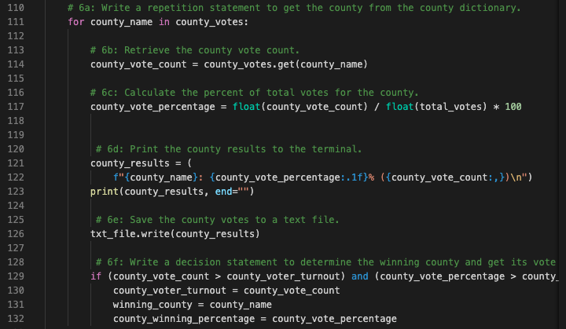
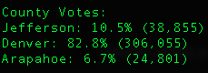
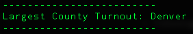
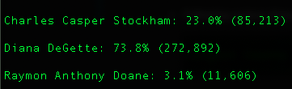
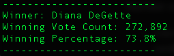
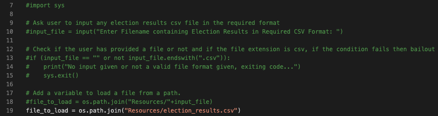

# Election Audit
## Overview of Election Audit

The scope of this project is to write a code in Python to perform Election Audit of Colorado Board of Election. Following tasks need to be performed to complete the election audit:

1. Calculate the total number of votes cast.
2. Calculate the voter turnout for each county and percentage of votes from each county.
3. Determine the winning county and get its vote count.
4. List the names of candidates who received votes.
5. Calculate the total number of votes each candidate received.
6. Calculate the percentage of votes each candidate won.
7. Determine the winner of the election board on popular vote.

## Resources
- Data Source: election_results.csv
- Software: Python 3.6.1, Visual Studio Code 1.47.3

## Election-Audit Results
Following are the detailed results of this election audit:

### Total Votes Cast:
- There were 369,711 votes cast in the election.
### Number of Votes and Percentage of Votes per County:
- Following is the code snippet that shows the main logic. The script loops over 'county_votes' dictionary for each 'county_name' and county vote count is retrieved from the 'county_votes' dictionary, which is then divided by 'total_votes' to get the percentage:

    

- Following output shows the number of votes each county received and the percentage of total voltes for each county in the precinct:

    

### Winning County:
- Following output shows the county with the largest turnout:

    

### Number of Votes and Percentage of Votes per Candidate:
- Following output shows the breakdown of votes and percentage of total votes each candidate received:

    

### Winner of Election and Stats:
- Following output shows that Diana DeGette won the election with 272,892 votes.

     

## Election-Audit Summary
With the successful execution of our script for Election Audit for Colorado Board of Election, we would like to extend a business proposal to the election commission. The objective of this business proposal is to highlight the power of PyPoll_Challenge.py script that can be utilized to generate results for any election. With the following modifications, same script can be executed to process any election results:

- Un-comment line # 7, 10, 13, 14, 15 and 18
- Comment line# 19

User can provide election results in the same format as "election_results.csv" and save it in the 'Resources' folder. Upon execution of the script, user will be asked to enter the election results csv file, which he wishes to process. Script will generate the results based on the data provided in this input file.